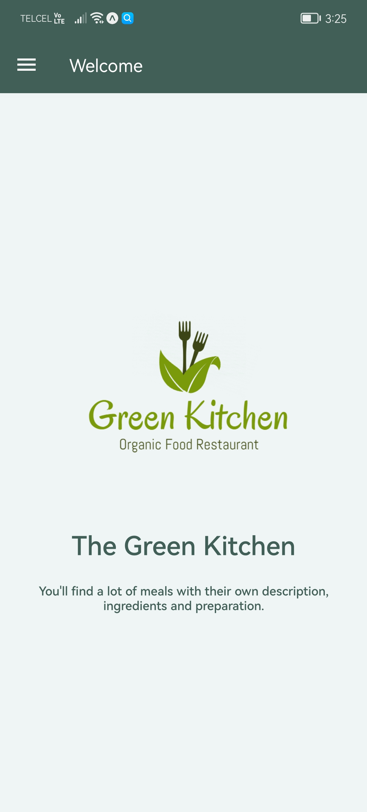
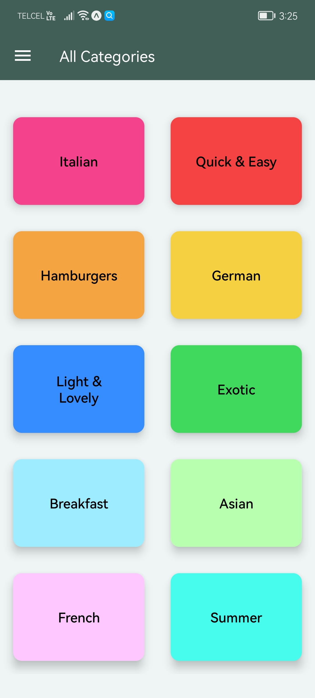
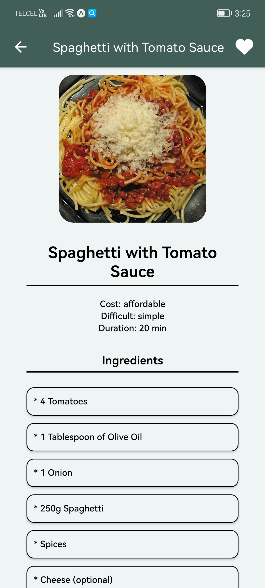
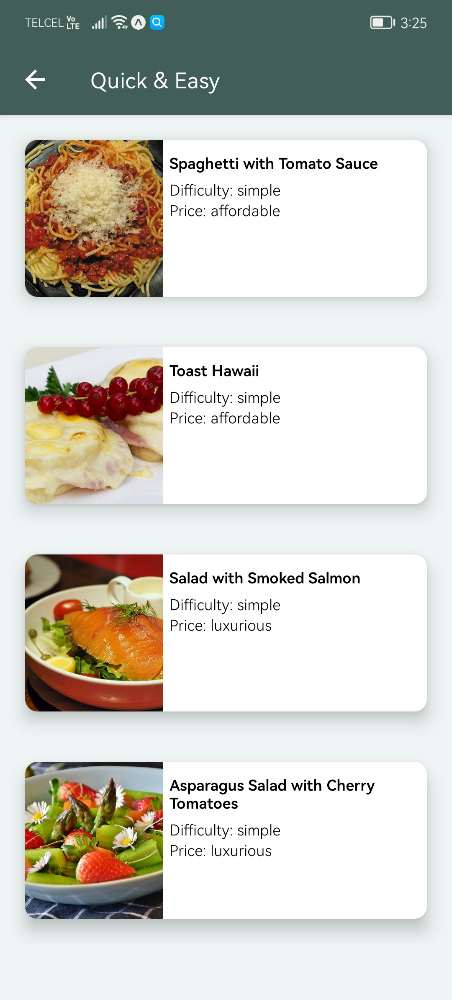
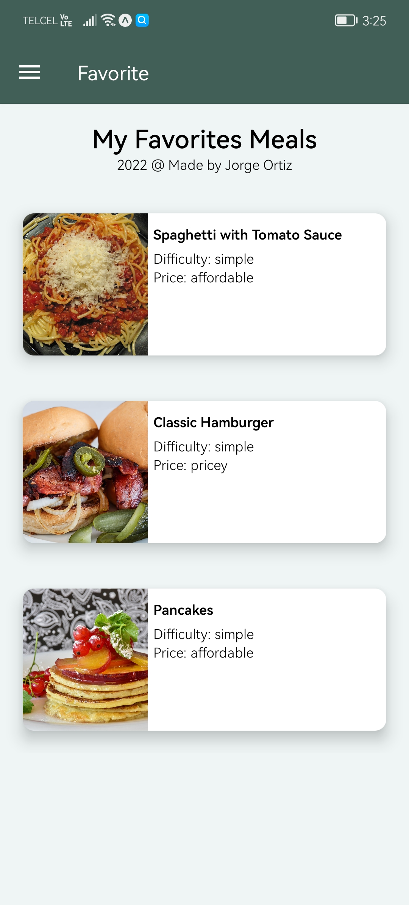

# The Meals App.

The Meals App was built with Docker and React Native.
## Description.

This is the meals App where you can find your favorite meals organize in multiple categories.
You can add you favorites meals and see your favorite meals in a different screen called **Favorites**.

## Preview.

  

## Images.

  
  
  

  
  

## Author.

* Jorge Ortiz.
* ortiz.mata.jorge@gmail.com
* Sogtware engineer.
